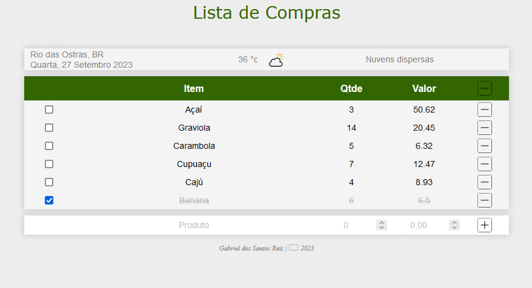
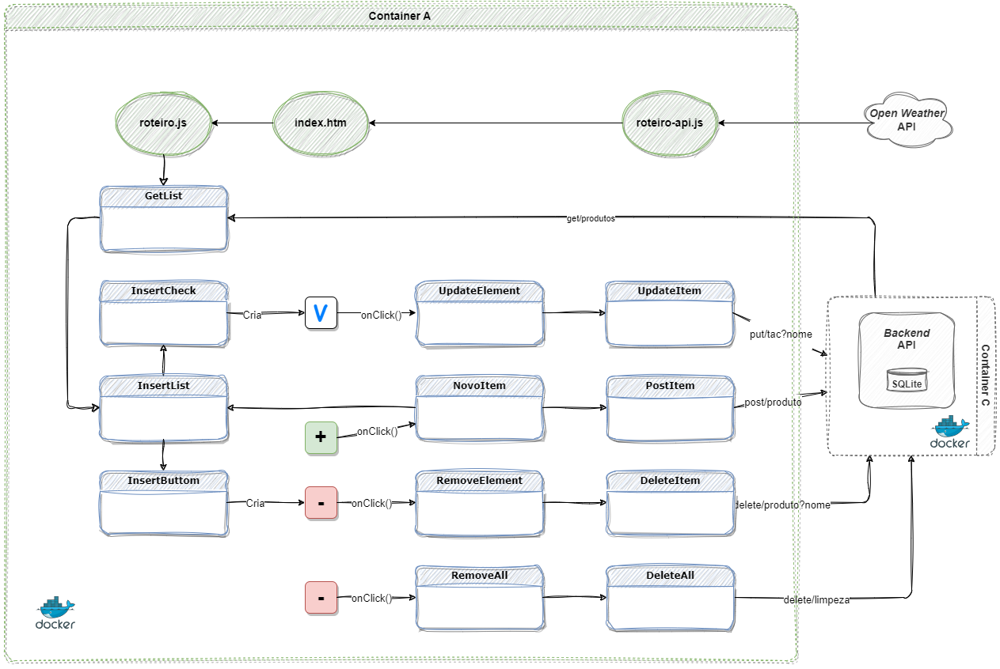

# Desenvolvimento em Full Stack (2023)

- Instituição: PUC-Rio Digital (EaD)
- Pós-graduação: *Lato Sensu*.
- Coordenação: [Marcos Kalinowski](https://www.linkedin.com/in/kalinowski/).
- Professores: [Fernando Correia](https://github.com/fernandus16), [Dieinison Braga](https://github.com/dieinisonbraga) e [Marisa Silva](https://github.com/marisa-ec).
- Aluno: [Gabriel dos Santos Reis](https://github.com/gaelsreis).

## MVP 3 - Desenvolvimento Back-end Avançado

O Produto Mínimo Viável / *Minimum Viable Product (MVP)* envolve a criação de três componentes: *frontend* consumindo uma API pública e uma API *backend*.

## Front-End

Projeto de uma uma lista de compras com as funções de buscar, inserir e excluir itens, em uma Aplicação de Tela Única / *Single-Page Application (SPA)* publicada com Dockerfile. O *frontend* faz uso de uma API pública, apresentando automaticamente a condição do tempo, baseado na localização do usuário. Também interage com uma API *backend* para armazenar os dados da lista.

### Principais tecnologias utilizadas

- [HTML](https://www.w3.org/html/)
- [CSS](https://www.w3schools.com/Css/)
- [JavaScript](https://www.ecma-international.org/publications-and-standards/standards/ecma-262/)
- [Docker](https://www.docker.com/)

## Instruções

### Utilizando contêiner

[Instale](https://docs.docker.com/engine/install/) e [execute](https://docs.docker.com/engine/reference/run/) o Docker. Segue abaixo comandos para trabalhar com imagem, no Windows:

~~~PowerShell
## Executar terminal como administrador
powershell start-process powershell -verb runas

## Construir imagem, como administrador
docker build -t frontend .

## Executar contêiner, como administrador
docker run -d -p 8080:80 frontend

## Comandos uteis

## Verificar se a imagem foi criada
docker images

## Remover imagem
docker rmi <IMAGE ID>

## Verificar se o contêiner está em exceução
docker container ls --all

## Parar contêiner
docker stop <CONTAINER ID>

## Destruir contêiner
docker rm <CONTAINER ID>
~~~

Abrir o projeto no [Firefox](http://localhost:8080/#/)

Abrir o projeto no [Chrome](http://127.0.0.1:8080/)

### API OpenWeather

[Inscreva-se](https://home.openweathermap.org/users/sign_up) grátis para obter a sua chave da API do [Open Weather](https://openweathermap.org/api), com direito a 2 mil chamadas por dia. Adicione sua chave na linha 2 do aquivo *roteiro-api.js:*

~~~js
const api = {
    key: "SUA CHAVE AQUI",
